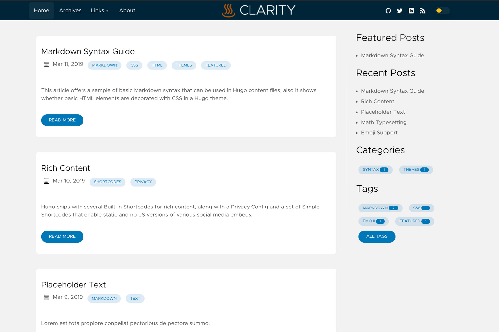
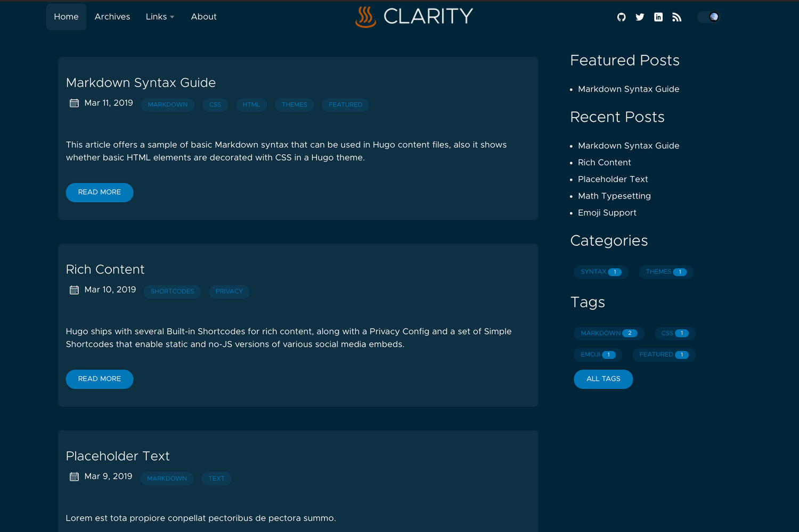

# Hugo Clarity

A technology-minded theme for Hugo based on VMware's open-source [Clarity Design System](https://clarity.design/) featuring rich code support, dark/light mode, mobile support, and much more. See [a live demo at __neonmirrors.net__](https://festive-agnesi-58e7e4.netlify.app/).



## Preview on Desktop

| Light Mode | Dark Mode |
|---| --- |
|  |  |

## Preview on Mobile

| Light Mode | Dark Mode |
|---| --- |
|  |  |

## Features

* Blog with tagging and category options
* Deeplinks
* Native Image Lazy Loading
* Customizable (see config)
* Dark Mode (with UI controls for user preference setting)
* Toggleable table of contents
* Flexible image configuration
* Logo alignment
* Mobile support with configurable menu alignment
* Syntax Highlighting
* Rich code block functions including:
    1. Copy to clipboard
    2. Toggle line wrap (dynamic)
    3. Toggle line numbers
    4. Language label
    5. Toggle block expansion/contraction (dynamic)

    To put it all in context, here is a preview showing all functionality.

    

## Prerequisites

Firstly, ensure you have installed the [extended version of Hugo](https://github.com/gohugoio/hugo/releases). See installation steps from [Hugo's official docs](https://gohugo.io/getting-started/installing/).

## Getting up and running

There are at least two ways of quickly getting started with Hugo and the VMware Clarity theme:

### Option 1 (recommended)

Generate a new Hugo site and add this theme as a Git submodule inside your themes folder:
  
```bash
$ hugo new site yourSiteName
$ cd yourSiteName
$ git init
$ git submodule add https://github.com/chipzoller/hugo-clarity themes/hugo-clarity
$ cp -a themes/hugo-clarity/exampleSite/ .
```

Then run

```bash
hugo server --themesDir ../..
```

Hurray!

### Option 2 (Great for testing quickly)

You can run your site directly from the `exampleSite`. To do so, use the following commands:

```bash
$ git clone https://github.com/chipzoller/hugo-clarity
$ cd hugo-clarity/exampleSite/
$ hugo server --themesDir ../..
```

> Although, option 2 is great for quick testing, it is somewhat problematic when you want to update your theme. You would need to be careful not to overwrite your changes.

Once set, jump over to the `config.toml` file and start [configuring](#configuration) your site.

## Configuration

This section will only cover settings that are unique to this theme. If something is not covered here (or elsewhere in this file), there's a good chance it is covered in [this Hugo docs page](https://gohugo.io/getting-started/configuration/#configuration-file).

### Global Settings (Work-in-Progress, needs redesign)

These options set global values that some pages or all pages in the site use by default.

| variable | setable on page | overidable |
|:---- | ---- | ---- |
| twitter | N/A | N/A |
| author | N/A | N/A |
| introDescription | N/A | N/A |
| numberOfTagsShownPerArticle | N/A | N/A |
| fallBackOgImage | yes | N/A |
| mobileNavigation | no | N/A |
| figurePositionShow | yes | yes |
| figurePositionLabel | no | no |

### Page level Settings

These options can be set from a page [frontmatter](https://gohugo.io/content-management/front-matter#readout) or via [archetypes](https://gohugo.io/content-management/archetypes/#readout)

## Modify links menu

To add, remove, or reorganize top menu links, [edit this yaml file](https://github.com/chipzoller/hugo-clarity/blob/master/exampleSite/data/menu.yaml)

## Edit social profile links

[Edit this yaml file](https://github.com/chipzoller/hugo-clarity/blob/master/exampleSite/data/social.yaml)

## Specify blog directory

Edit the `config.toml` file and change the `mainSections` key. Values will be directories where the blogs reside.

```yaml
[params]
...
mainSections = ["posts", "docs", "blogs"]
...
```

For more info, see the [Hugo docs](https://gohugo.io/functions/where/#mainsections).

## Mobile menu positioning

The navigation menu when mobile browsing can be configured in `config.toml` to open right or left depending on preference. The "hamburger" menu icon will always display in the upper right hand corner regardless.

```yaml
[params]
...
mobileNavigation = "left" # Mobile nav menu will open to the left of the screen.
...
```

## Tags

### Show number of tags

The number of tags that should be shown can be configured so that any more than this value will only be accessible when clicking the All Tags button. This is to ensure a large number of tags can be easily managed without consuming excess screen real estate. Edit the `numberOfTagsShownPerArticle` parameter and set accordingly.

```yaml
[params]
...
numberOfTagsShownPerArticle = 4 # Applies for categories & custom taxonomies. e.g brands
...
```

#### Example


## Images

### Image figure captions

You have the option of adding captions to images in blog posts and automatically prepending a desired string such as "Figure N" to the alt text. This is controlled via two global settings.

`figurePositionLabel` is a string which will be prepended to any alt text of an article image. By default, this is set to "Figure." And `figurePositionShow` controls, globally, whether to show this label. It does not affect whether to show the image alt text, only the prefix figure caption. For more granular control, `figurePositionShow` can be overridden at the article level if desired.

The number will be automatically calculated and assigned after the `figurePositionLabel` text starting from the top of the article and counting down. Featured images will be excluded from this figuration.

#### Example

In this example, `figurePositionLabel` is set to "Figure" in `config.toml` and this is the first image in a given article.

```markdown

```


### Inline images

To make a blog image inline, append `:inline` to its alt text. Typically, inline images will have no alt text associated with them.

#### Example

```markdown
<!-- some image without alt text -->


<!-- some image with alt text -->


```


### Float images to the left

To align a blog image to the left, append `:left` to its alt text. Article text will then flow to the right of the image.

#### Example

```markdown
<!-- some image without alt text -->


<!-- some image with alt text -->


```

### Article thumbnail image

Blog articles can specify a thumbnail image which will be displayed to the left of the card on the home page. Thumbnails should be square (height:width ratio of `1:1`). They will be specified using a frontmatter variable as follows:

```yaml
...
thumbnail: "images/2020-04/capv-overview/featured.jpg"
...
```

The thumbnail image will take precedence on opengraph share tags if the [shareImage](#share-image) parameter is not specified.

### Article featured image

Each article can specify an image that appears at the top of the content. When sharing the blog article on social media, if a thumnail is not specified, the featured image will be used as a fallback on opengraph share tags.

```yaml
...
featureImage: "images/2020-04/capv-overview/featured.jpg"
...
```

### Share Image

Sometimes, you want to explicitly set the image that will be used in the preview when you share an article on social media. You can do so in the front matter.

```yaml
...
shareImage = "images/theImageToBeUsedOnShare.png"
...
```

### Align logo

You can align your site's logo either to the left or in the center.

```yaml
...
centerLogo = true # Change to false to align left
...
```

## Code

### Display line numbers

Choose whether to display line numbers within a code block globally with the parameter `codeLineNumbers` setting to `true` or `false`.

```yaml
[params]
...
codeLineNumbers = true # Shows line numbers for all code blocks globally.
...
```

### Limit code block height

You can globally control the number of lines which are displayed by default for your code blocks. Code which has the number of lines exceed this value will dynamically cause two code block expansion buttons to appear, allowing the user to expand to full length and contract. This is useful when sharing code or scripts with tens or hundreds of lines where you wish to control how many are displayed. Under params in `config.toml` file, add a value as follows:

```yaml
[params]
...
codeMaxLines = 10 # Maximum number of lines to be shown by default across all articles.
...
```

> If the value already exists, change it to the desired number. This will apply globally.

If you need more granular control, this parameter can be overridden at the blog article level. Add the same value to your article frontmatter as follows:

```yaml
...
codeMaxLines = 15 # Maximum number of lines to be shown in code blocks in this blog post.
...
```

If `codeMaxLines` is specified both in `config.toml` and in the article frontmatter, the value specified in the article frontmatter will apply to the given article. In the above example, the global default is `10` and yet the article value is `15` so code blocks in this article will auto-collapse after 15 lines.

## Page controls (not sure what to do with this)

### Toggle table of contents

Each article can optionally have a table of contents (TOC) generated for it based on top-level links. By configuring the `toc` parameter in the article frontmatter and setting it to `true`, a TOC will be generated only for that article. The TOC will then render under the featured image.

#### Example


